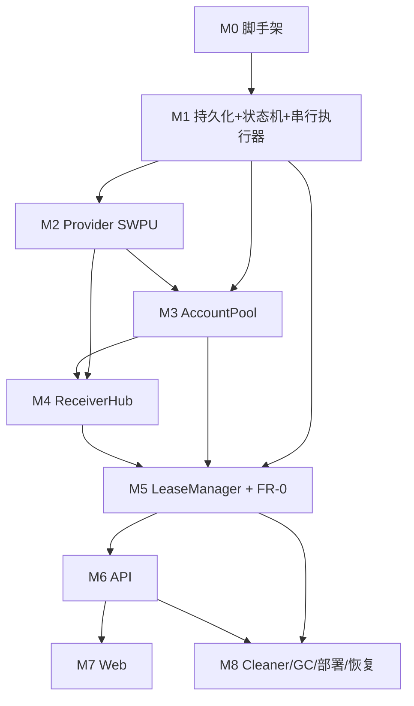

# 邮箱接码服务（mail-code-service）· 开发实施计划

> **本文定位**：把需求文档的 **WHAT/WHY** 转化为可执行的 **HOW/WHEN**。
> - 需求文档（WHAT/WHY，逐条 FR/不变量/验收）：`../../docs/邮箱接码服务.md`
> - 单账号能力基座（本服务 Provider 层直接构建于其上）：`../../docs/swpu-email-requirements.md`
> - 已验证接口知识（只读参考，独立实现）：`../../src/emailManage/swpu-mail-api.md`、`imap-recv-test.js`、`imap-del-test.js`
> - 隐身浏览器用法：`../../docs/cloakbrowser-nodejs.md`
>
> **编制日期**：2026-06-26 ｜ **状态**：实施草案
> **阅读约定**：本文**不复制**需求文档已有的 API 规格（§9）与数据模型（§8），仅在 [§4](#4-数据库落地完整-ddl) 补全为可执行 DDL；其余引用需求 FR 编号以便追溯。

---

## 0. 三条实施总原则（贯穿全程）

| 原则 | 含义 | 为什么 |
|---|---|---|
| **P1 护栏先行** | DB partial unique index + CHECK + **单写串行执行器** 在 M1 地基阶段就位；此后**一切状态变更无例外地经它**，绝不"先跑通再补锁"。 | FR-0「杜绝一码多码」是头号目标（需求 §1.2/§6）。竞态护栏一旦留到最后补，等于推倒重来。 |
| **P2 垂直切片优先（Walking Skeleton）** | 先用最小实现贯通 `createLease → setAlias → IMAP 收一次码 → RECEIVED 原子扣配额 → 超时释放` 这条**最薄主链**（账号可写死 1 个、无 API、无前端，用脚本驱动），证明核心价值 + FR-0 生效；再水平补全池/Hub/API/Web。 | 这条链路串起了项目所有最难的部分（IMAP 路由、原子事务、状态机、超时）。先打通它，风险前置出清；其余多为外围装配。 |
| **P3 接口先于多态** | Provider / QueuePort / LockPort **先定接口**，SWPU / 内存各**只做一个实现**；多校（其它大学）、Redis 仅留**扩展点不实现**。 | 需求 §0.3「新增大学零改调度核心」、§10.5「预留 Redis」。过早抽象多实现会拖慢首版（CLAUDE.md：避免过早抽象）。 |

---

## 1. 里程碑总览

### 1.1 里程碑一览（M0–M8）

| 里程碑 | 名称 | 核心目标 | 对应需求 | 依赖 |
|---|---|---|---|---|
| **M0** | 工程脚手架 | 独立 git + ESM 工程 + 依赖 + 目录骨架 + `/healthz` 可起 | §11 | — |
| **M1** | 持久化与状态地基 | SQLite + 完整 DDL + 护栏索引 + 状态机 + **单写串行执行器** | §6 FR-0、§8、C-6/C-7 | M0 |
| **M2** | Provider（SWPU 实现） | EmailProvider 接口 + SWPU：登录/别名 HTTP/IMAP 收码/删信 | §0、基座 FR-1~4 | M1 |
| **M3** | 资源层 AccountPool | 账号注册表/健康态/原子 acquire-release/重启恢复占用 | §6 FR-1 | M1、M2 |
| **M4** | 收码聚合 ReceiverHub | 按需 IMAP（绑定租约时连）→匹配→路由到活跃租约 + 幂等 | §6 FR-4 | M2、M3 |
| **M5** | 调度核心 LeaseManager + Access/Plan + **FR-0 全护栏** | 取码闭环 + 原子收码事务 + 超时/renew/cancel + 单飞 + 队列 + 唯一码校验配额 | §6 FR-0/FR-2/FR-3/FR-5 | M1、M3、M4 |
| **M6** | 接入层 API | public / v1(API Key) / admin 三组路由 + SSE + 限流 + 错误码 | §6 FR-6.3/FR-7/FR-8、§9 | M5 |
| **M7** | Web 前端 | `/{code}` 申请邮箱/倒计时/SSE 回显整封邮件/重申请/回看 | §6 FR-6 | M6 |
| **M8** | 运维·部署·可恢复 | Cleaner 删信 + 7 天 GC + 优雅停机 + 重启恢复 + Docker | §6 FR-9/FR-10、§10.5、C-6 | M5、M6 |

> **M5 是项目大脑，体量最大、风险最高**；M2（SWPU 登录/收码）是第二风险源。两者建议按 P2 先做"最小子集"，骨架贯通后再回头补全。

### 1.2 推荐推进次序（两个波次）

```
波次一 · 核心闭环（Walking Skeleton，脚本驱动，证明 FR-0）
  M0 ─▶ M1 ─▶ M2(最小: session+setAlias+IMAP收码) ─▶ M5(最小: 单账号写死, createLease+原子收码事务+超时)
  ✅ 出口：一段脚本能"申请→收一次码→RECEIVED 扣配额→超时释放"，且并发/重复投递不破护栏

波次二 · 产品化（向外补全）
  M3 池 ─┬─▶ M4 Hub 完整 ─▶ M5 完整(队列/renew/cancel/单飞/Access&Plan/多账号) ─▶ M6 API ─▶ M7 Web
         └─▶ M8 Cleaner/GC/部署（可与 M6/M7 并行穿插）
```

**关键路径**：`M0→M1→M2→M5`（核心闭环）。M7 前端可与 M6 后半段并行；M8 的 Cleaner/GC 与主链无依赖，可随时穿插。

### 1.3 依赖图



---

## 2. 里程碑详解（目标 / 任务 WBS / 交付物 / 验收）

### M0 · 工程脚手架

**目标**：可运行的独立 ESM 工程，`npm run dev` 起一个最小 fastify 服务并响应 `/healthz`。

**任务 WBS**
- [ ] `git init`（独立仓库，与 register-factory 解耦）；`.gitignore`（`node_modules/`、`data/`、`.env`、`*.log`）
- [ ] `package.json`：`"type":"module"`，`engines.node>=20`，scripts（见 [§6.3](#63-npm-scripts)）
- [ ] 安装依赖（见 [§6.2](#62-依赖清单)）
- [ ] 目录骨架（见 [§6.1](#61-目录结构落到文件)）
- [ ] `.env.example` + `src/config.js`（集中读取环境变量，缺失即报错，**不硬编码**，NFR-4）
- [ ] eslint + prettier（中文注释，JSDoc3 风格，遵循全局 CLAUDE.md）
- [ ] `src/index.js`：装配 fastify，注册 `/healthz`（先返回 `{ ok:true }`，M8 再补池水位/IMAP 连接数）
- [ ] `src/logger.js`：结构化日志，**脱敏中间件**（凭据/cookie/IMAP 密码一律不打印，NFR-1/NFR-7）

**交付物**：可启动的空壳服务。
**验收**：`npm run dev` → `GET /healthz` 返回 200。

---

### M1 · 持久化与状态地基（护栏在此就位）

**目标**：落地需求 §8 全部表 + DB 护栏 + 状态机 + **单写串行执行器**——后续所有状态变更的强制通道。

**任务 WBS**
- [ ] `src/store/db.js`：better-sqlite3 连接，`PRAGMA journal_mode=WAL`、`foreign_keys=ON`
- [ ] `src/store/schema.sql` + `src/store/migrate.js`：执行 [§4](#4-数据库落地完整-ddl) 完整 DDL（含 partial unique index、CHECK、processed_mail 复合主键）
- [ ] `src/store/*.repo.js`：account / plan / accessCode / lease / processedMail / auditLog 各一组 CRUD（**纯 SQL，无业务判断**）
- [ ] `src/core/state-machine.js`：定义 lease 与 access_code 的**合法状态集与转移表**，提供 `assertTransition(from,to)`，非法转移抛错（落地 INV-4/M6 终态不可逆）
- [ ] `src/core/serial-executor.js`：**单写串行执行器**（FR-0 M1）——把任务函数入单队列顺序 `await` 执行；对外 `submit(fn): Promise`。所有"读—判断—写"收敛于此（INV-6，消 TOCTOU）
- [ ] `src/store/tx.js`：`better-sqlite3` 事务包装（`BEGIN IMMEDIATE`），供原子收码事务复用

**交付物**：可建库、可读写、状态机模块、串行执行器。
**验收（单测）**
- DB 拒绝同码/同账号第二个 `active` 租约（partial unique index 抛错）
- `quota_left` 减到 0 后再减触发 CHECK 失败
- `assertTransition('received','active')` 抛错（终态不可逆）
- 100 个并发 `submit` 严格串行、无交叉

---

### M2 · Provider（EmailProvider 接口 + SWPU 实现）

**目标**：把基座单账号能力（`swpu-email-requirements.md`）实现为统一 `EmailProvider`；SWPU 为首个实现。**浏览器只登录（L1 拟真）**，常态走 HTTP（别名）+ IMAP（收码/删信）。

> ⚠️ 不照搬 `register-factory/src/emailManage/swpu-email-manager.js` 的**浏览器全程常驻**方案。本服务按基座 §1.2「浏览器只登录」独立实现轻量版（`page.evaluate(fetch)` 仅作 L3 兜底，见基座 §10.6）。

**任务 WBS**
- [ ] `src/provider/email-provider.js`：定义接口（需求 §0.1 全部方法 + `ProviderCaps`/`Session`/`MailMatch`/`MailMeta` 类型注释）
- [ ] `src/provider/swpu/session.js`（基座 FR-1）：CloakBrowser 登录（渐进表单 + 打码）→ 提取 `{cookies, zid, ua, headers}` → 持久化 `data/swpu-session.<id>.json` → **single-flight 重登** → `?q=base` 探针（按响应体文本判失效，**非状态码**，基座 FR-1.8）→ 失效自愈重放（封顶）
- [ ] `src/provider/swpu/http.js`（基座 FR-2）：`getCurrentAlias`/`setAlias`（`action=mod`，冲突加后缀重试）；**L1 拟真**（全量 cookie + UA + Referer/Origin/X-Requested-With/sec-ch-ua，NFR-8）
- [ ] `src/provider/swpu/imap.js`（基座 FR-4）：`mailgate.swpu.edu.cn:993` 隐式 TLS **按需连接**；`start`/`stop` 经串行链 + 连接代际（epoch）管理生命周期；`subscribeMail(match,onMail)` 订阅（IDLE 监听 `exists`，租约期内断线重连）；三重匹配 + **秒级精筛**（`INTERNALDATE/Date ≥ startTime`，规避 SINCE 仅到“天”）；交付**整封邮件** MailMeta（不在此提码）
- [ ] `src/provider/swpu/cleanup.js`（基座 FR-3）：IMAP `search` 取 UID → `messageDelete`（`STORE \Deleted`+`EXPUNGE`，**必须按 UID**）
- [ ] `src/provider/swpu/capabilities.js`：`{ aliasRule, receiveChannel:'imap', supportsImapDelete:true, codeRegex 默认 }`
- [ ] `src/provider/swpu/index.js`：组装为一个 `EmailProvider` 实例

**交付物**：单账号 demo 脚本（`scripts/demo-swpu.js`）：设别名 → 订阅收码 → 收到整封邮件 → 删信。
**验收**（对齐基座 §8）：无浏览器常驻下别名/收码/删信成功；会话失效自动重登且并发只登一次；三重匹配准确、超时正确返回；全链路日志无明文凭据。

---

### M3 · 资源层 AccountPool

**目标**：维护账号清单与健康态，原子分配/释放，启动恢复占用关系。

**任务 WBS**
- [ ] `src/pool/account-pool.js`
  - [ ] 健康状态机：`free | leased | reloging | unhealthy | disabled`（FR-1.2）；IMAP 断连/登录连续失败→`unhealthy` 暂不参与分配，自愈后回 `free`
  - [ ] `acquire(allowedGroups)`：**经串行执行器**原子挑一个 `free` 账号置 `leased`（杜绝双占，INV-2/NFR-3）；无空闲返回 null（由 LeaseManager 决定排队）
  - [ ] `release(accountId, result)`：置回 `free`，可选**冷却期**（释放后 N 秒再可分配，给 IMAP/别名状态稳定时间，FR-1.4）
  - [ ] 启动恢复：从 Store 恢复占用关系 + 加载持久化会话（**不在启动时建 IMAP**；IMAP 由 ReceiverHub 绑定租约时按需连，FR-1.5/FR-4.1）

**交付物**：可分配/释放/恢复的池。
**验收**：并发 `acquire` 不双占；重启后 `leased` 占用关系正确恢复。

---

### M4 · 收码聚合 ReceiverHub

**目标**：绑定租约时**按需建** IMAP 连接，命中邮件**主动推**给该账号当前活跃租约（推模型，FR-4.1）；收码/超时/取消即断连。

**任务 WBS**
- [ ] `src/receiver/receiver-hub.js`
  - [ ] `bindLease`：按需 `startReceiver`（建连）+ `provider.subscribeMail` 订阅（租约生命周期内持有）；`unbindLease`：取消订阅 + 后台断连
  - [ ] 路由：因 C-1 每账号至多一个 `active` 租约，命中邮件按 §C-4 匹配后喂给该账号当前活跃租约
  - [ ] **收码幂等**：写 `processed_mail(account_id, uid)`，同邮件二次进入直接丢弃（M5/FR-0 M5）
  - [ ] 命中后回调 LeaseManager 的"收码交付"入口（**不在此扣配额**，交付事务在 M5）

**交付物**：邮件命中 → 路由到对应活跃租约的链路。
**验收**：向某别名发信，能精确路由到持有该别名的租约；同邮件重复事件只路由一次。

---

### M5 · 调度核心 LeaseManager + Access/Plan + FR-0 全护栏（核心）

**目标**：完整取码闭环，**所有变更经串行执行器**；落地 FR-0 全部不变量与威胁路径封堵（[§3.1](#31-fr-0-一码多码护栏落地清单)）。

**任务 WBS**
- [ ] `src/access/access-service.js`（D 层，FR-2.4 校验分流）：`unused/active && quota_left>0`→建/复用租约；`used && now≤retain_until`→只读回看（不建租约不扣配额，FR-2.7）；`expired`→`CODE_EXPIRED`；`revoked`/前缀停用→对应错误码
- [ ] `src/access/code-gen.js`：唯一码生成 `<prefix>-<random≥128bit>`（不可枚举，NFR-1）；批量生成（FR-2.3）
- [ ] `src/lease/lease-manager.js`（C 层，核心）
  - [ ] `createLease(accessCode)`（FR-3.2）：校验 → `pool.acquire` → 无空闲入 **PENDING 队列**（FIFO，`acquireTimeout` 默认 60s，超时 `REJECTED`/`POOL_BUSY`，**首版无位次/ETA**，FR-3.8）→ `provider.setAlias`（[§3.7](#37-别名生成)）→ 记 `start_time`/`expires_at=now+ttl` → 置 `ACTIVE` → 绑定 ReceiverHub
  - [ ] **收码交付原子事务**（[§3.2](#32-收码交付原子事务核心)，INV-3/4/5）：`ACTIVE→RECEIVED` 与扣配额**同一事务**，affected 行数校验，任一失败回滚丢弃邮件
  - [ ] 超时释放（FR-3.4/FR-5.1）：到 `expires_at` 仍 `ACTIVE`→`EXPIRED`→`release`→解绑；**不扣配额**
  - [ ] `renewLease`（FR-3.5）：`quota_left>0` 且当前租约为终态时再 `createLease`（计 `renews`，受 `max_renews`）；**先原子置旧租约终态再建新**（封堵威胁路径 H）
  - [ ] `cancel`（FR-3.6）：立即释放
  - [ ] **activate 单飞锁**（FR-0 M4）：按 `accessCode` 进程内单飞，同码并发 activate 共享同一结果
- [ ] `src/lease/ports/{queue,lock}.js`：`QueuePort`/`LockPort` 接口 + 内存实现（[§3.8](#38-ports-抽象queueport--lockport)，预留 Redis）
- [ ] `src/lease/timer.js`：租约超时定时器登记/取消（进程内；重启由 M8 恢复巡检）

**交付物**：脚本可完整跑通"申请→收码→扣配额→超时→重申请"。
**验收（FR-0 竞态用例，需求 §12 #9，[§5.3](#53-竞态验收用例编排-12-9-必须全过) 给出编排）**：六个竞态用例①~⑥全部通过。

---

### M6 · 接入层 API（fastify）

**目标**：需求 §9 三组路由 + SSE + 限流 + 统一错误码。

**任务 WBS**
- [ ] `src/api/public.js`：`POST /api/public/activate`（分流 active/pending/used/expired）、`GET /leases/:id`、`GET /leases/:id/stream`（**SSE**）、`POST /leases/:id/renew`、`POST /leases/:id/cancel`、`GET /codes/:code/results`（回看）
- [ ] `src/api/sse.js`：SSE 生命周期（[§3.6](#36-sse-生命周期)）——`message`/`done` 事件、终态 `end()`、已结束租约重连回 **204**、**单活跃订阅**（进程内 `Map<accessCode, conn>` 只留最新，FR-6.8 首版极简）
- [ ] `src/api/v1.js`：`X-API-Key` 鉴权；`POST/GET/DELETE /api/v1/leases`；webhook（`callbackUrl`，HMAC 签名 + 重试/超时 + 按 `leaseId` 幂等，FR-7.3）
- [ ] `src/api/admin.js`：accounts/plans/codes（批量生成/吊销/导出）/stats；独立鉴权（FR-8.5）
- [ ] `src/api/errors.js`：统一错误码（`CODE_NOT_FOUND`/`CODE_EXPIRED`/`CODE_EXHAUSTED`/`POOL_BUSY`/`LEASE_NOT_FOUND`/`RENEW_LIMIT`），响应 `{errCode,errMsg,data}`
- [ ] 限流（NFR-4）：按唯一码/IP 限流 `activate`

**交付物**：REST + SSE 跑通，自用 API 可被 register-factory 集成。
**验收**：需求 §12 #3/#6 通过；同码并发 activate 复用同一租约（§9 单飞语义）；SSE 终态收尾正确不重连。

---

### M7 · Web 前端（React + Vite）

**目标**：付费用户 `/{code}` 取码全流程可视。

**任务 WBS**
- [ ] `web/`（Vite + React）：路由 `/{code}`，**加载仅预填唯一码不自动占用**（FR-6.1）
- [ ] 「申请邮箱」按钮 → `activate`；展示别名（一键复制）、套餐说明、**15:00 倒计时**、状态条（FR-6.2）
- [ ] SSE 实时回显**整封邮件**（发件人/主题/正文，可复制；尽力抽到 `code` 则高亮便利字段，FR-6.3）；不可用回退轮询
- [ ] 异常态文案（前缀无效/用尽/过期/`POOL_BUSY`，FR-6.4）；`EXPIRED` 后「重新获取邮箱」（FR-6.5）
- [ ] **回看视图**（`used` 态只读历史邮件 + 剩余保留时间，FR-6.9）；**不泄露**账号真实地址/池规模/他人订单（FR-6.6）
- [ ] 构建产物经 `@fastify/static` 托管

**交付物**：可视取码页面。
**验收**：需求 §12 #5/#11 通过。

---

### M8 · 运维·部署·可恢复

**目标**：删信/GC 定时任务、优雅停机、重启恢复、容器化。

**任务 WBS**
- [ ] `src/cleaner/cleaner.js`（FR-9）：定时 IMAP `search` 取 UID → 批量 `messageDelete`；独立连接/错开收码窗口，不影响活跃租约
- [ ] `src/cleaner/gc.js`（FR-10）：把 `retain_until<now` 的码置 `expired`；物理删除 `expired` 码及关联 lease/收码详情/processed_mail（**清理前校验无活跃租约**）；`unused` 永久保留不清理
- [ ] 重启恢复（[§3.5](#35-状态持久化与重启恢复-c-6)，C-6）：恢复占用 → 为 active 租约按需重连 IMAP → 未决 `active` 租约按 `expires_at` 立即超时巡检或续跑
- [ ] 优雅停机（NFR-9）：SIGTERM → 停止接收新 activate → 持久化在途 → 关闭 IMAP → 退出
- [ ] `/healthz` 补全：池 free/leased/unhealthy、IMAP 连接数
- [ ] 监控指标（NFR-6）：池水位、排队数、收码成功率/平均时延/超时率
- [ ] `Dockerfile`（[§6.4](#64-docker-要点)）：构建期 `npx cloakbrowser install` 预置二进制、运行期固定 `CLOAKBROWSER_BINARY_PATH` + `AUTO_UPDATE=false`、`--init`/tini、Xvfb（有头登录）
- [ ] `docker-compose.yml`：单实例 + `data/` named volume

**交付物**：可部署容器，重启状态正确恢复。
**验收**：需求 §12 #7 通过；杀进程重启后占用/IMAP/未决租约正确恢复。

---

## 3. 关键专项实施方案（难点的 HOW）

> 本章把需求里只给了 WHAT 的几处难点，落成可直接编码的 HOW。

### 3.1 FR-0 一码多码护栏落地清单

**四道防线（缺一不可）**

| 防线 | 机制 | 代码落点 |
|---|---|---|
| 1 数据库护栏 | partial unique index（同码/同账号至多 1 active）+ `quota_left` CHECK≥0 + `processed_mail` 复合主键 | `store/schema.sql`（M1） |
| 2 单写串行 | 所有状态变更经 SerialExecutor（消 TOCTOU，INV-6） | `core/serial-executor.js`（M1） |
| 3 原子事务 | 收码交付与扣配额同事务、affected 校验（INV-3/4/5） | `lease/lease-manager.js`（[§3.2](#32-收码交付原子事务核心)） |
| 4 幂等 + 终态不可逆 | `processed_mail` 去重（M5）+ 状态机拒绝终态复活（M6） | `receiver-hub.js` + `state-machine.js` |

**威胁路径 A–H → 封堵落点**（需求 §6 FR-0.3 的实现映射）

| 路径 | 封堵落点 |
|---|---|
| A 同码并发双 activate | 单飞锁（`lease-manager.activate`）+ INV-1 DB index |
| B 两封邮件同时扣配额（TOCTOU） | 原子条件 `UPDATE ... WHERE quota_left>0`（[§3.2](#32-收码交付原子事务核心)） |
| C 重申请后旧别名迟到来码 | 旧租约已终态 → 交付事务①affected=0 → 丢弃 |
| D 配额耗尽后再 activate | `access-service` 不新建租约：保留期回看 / 过期 `CODE_EXPIRED` |
| E 一账号被两租约占用 | INV-2 DB index + `pool.acquire` 经串行执行器 |
| F 同邮件 IMAP 事件触发两次 | `processed_mail` 幂等 + 交付事务①第二次 affected=0 |
| G 重启把 RECEIVED 误当 ACTIVE | 恢复以 DB 为准，终态不复活（[§3.5](#35-状态持久化与重启恢复-c-6)） |
| H renew 出现两个 ACTIVE | renew 先原子置旧租约终态再建新 + INV-1 兜底 |

**断言与告警**：交付事务中若"配额已 0 却仍在交付"（②affected=0）→ ROLLBACK + 记 `audit_log` 严重不一致告警（需求 §6 FR-0.2 M3）。

### 3.2 收码交付原子事务（核心）

需求 §6 FR-0.2 M3 的 better-sqlite3 落地骨架（**交付物=整封邮件**，不在此提码）：

```js
/**
 * 收码交付：唯一一次 ACTIVE→RECEIVED 转换，同事务内扣配额。
 * 经 SerialExecutor 提交；返回是否成功交付（true 才向取码方推送）。
 */
const deliverMail = db.transaction((leaseId, accessCode, uid, mailJson) => {
  // ① 仅当租约仍 active 才推进（拦重复投递/已超时/已取消）
  const r1 = db.prepare(
    `UPDATE lease SET status='received', mail_uid=?, mail_meta=?
       WHERE id=? AND status='active'`
  ).run(uid, mailJson, leaseId);
  if (r1.changes === 0) return false;          // 已非 active → 丢弃此邮件（路径 C/F/G）

  // ② 同事务扣配额；affected 必须=1
  const r2 = db.prepare(
    `UPDATE access_code SET quota_left = quota_left - 1
       WHERE code=? AND quota_left > 0`
  ).run(accessCode);
  if (r2.changes !== 1) {                        // 配额已耗尽却仍在交付 → 严重不一致
    auditLog('quota_inconsistent', accessCode);  // 告警
    throw new Error('QUOTA_INCONSISTENT');       // 触发整体 ROLLBACK
  }
  // quota_left 归零时由调用方在事务外把 access_code 置 used、设 retain_until
  return true;                                   // COMMIT —— 用户"拿到邮件"以此为准
});
```

> **要点**：`db.transaction()` 默认 `DEFERRED`，写操作首次写时升级为写锁；如需更强可用 `BEGIN IMMEDIATE`。两条 UPDATE 任一不达预期即整体回滚，杜绝"邮件交付了配额没扣"或反之。

### 3.3 IMAP 按需连接与路由

| 关注点 | 方案 |
|---|---|
| 连接 | `imapflow` **按需连接**（`mailgate.<domain>:993` 隐式 TLS），绑定租约时建、释放/收码/超时断；`start`/`stop` 经串行链 + 连接代际（epoch）防建断竞态 |
| 实时 | `IDLE` 监听 `exists` 事件；事件到达后 `fetch` 新 UID |
| 断线重连 | 指数退避（1s→2s→…→上限 30s），连续失败 N 次→账号置 `unhealthy`（FR-1.2）并告警 |
| 匹配（C-4，防串号） | 主键 `To=本租约别名`（一次性全域唯一）+ `From` 命中目标发件人 + 时间窗；`From` **按域名/通配**（`@github.com`、`*.sendgrid.net`），不写死单地址 |
| 时间窗 | IMAP `SINCE` 仅到"天"，**客户端再按 `INTERNALDATE/Date` 秒级 `≥ start_time` 精筛**，排除别名复用前历史邮件（R-2） |
| 幂等 | 命中先查 `processed_mail(account_id, uid)`，已处理直接丢弃 |
| 删信隔离 | Cleaner 用独立连接/错开窗口，EXPUNGE 仅作用选中 UID（FR-9.2） |

### 3.4 会话失效自愈与 single-flight（SWPU）

落地基座 FR-1.5/1.6/1.8：

```
HTTP 调用返回体判 _login（或 ?q=base 探针文本含 "q=login"/失效 alert 文案）
  └─ 失效 → 取 single-flight 登录 Promise（已有则复用，无则新建并拉起 CloakBrowser）
        └─ 登录成功 → 提取 cookie+zid+ua+headers 落盘 → 重放原请求（次数封顶，默认 1）
  └─ 期间该账号其它请求共享同一登录 Promise，绝不并发开多浏览器
```
- **探针陷阱**：必须用 `?q=base`，不可用根路径 `/`（基座 FR-1.8 实测）。
- **zid 轻量刷新**：cookie 有效但缺 zid 时，先纯 HTTP `GET /?q=base` 正则提 `gZid`，避免开浏览器（基座 FR-1.7）。

### 3.5 状态持久化与重启恢复（C-6）

启动序列（M8）：

```
1. 读 DB：account / lease(status=active|pending) / access_code
2. 恢复占用：对每个 active 租约，把其 account 标 leased（重建 pool 内存态）
3. 按需重连 IMAP：对持有 active 未过期租约的账号重连 + 重新绑定路由（连接失败则该租约转超时）
4. 未决租约处置：
   - active 且 now ≥ expires_at → 立即走超时流程（EXPIRED→release）
   - active 且 now < expires_at → 重新登记超时定时器（剩余 = expires_at - now）
   - pending → 重新入队（或按策略直接 REJECTED）
5. 终态租约（received/expired/...）一律不复活（INV-4，封堵路径 G）
```

### 3.6 SSE 生命周期

落地 FR-6.3/6.7/6.8：
- **事件**：`message`（状态更新：pending→active→…）；`done`（终态 received/expired/cancelled，附最终状态 + 整封邮件）后 `reply.raw.end()`。
- **前端**：收 `done` 主动 `es.close()`，不再重连。
- **重连兜底**：对已结束租约的 stream 请求回 **204**，使前端彻底停止。
- **单活跃订阅（首版极简）**：进程内 `Map<accessCode, connection>`，**新连接建立即关旧连接**，保证不重复推送。正确性不依赖它（真正防一码多码靠 FR-0）；`seq` 防乒乓/`superseded` 事件**列为 v2**。

### 3.7 别名生成

落地 FR-3.3：
- 策略：随机/可读（可参考 register-factory 的 alias-generator **思路**，独立实现，不 import）。
- 约束：满足 `capabilities().aliasRule`（字符集/长度/域名）+ 目标平台兼容。
- 唯一：域内全局唯一；冲突时**委托 provider.setAlias 自动加数字后缀重试**（基座 FR-2.3），返回最终生效别名写入租约。

### 3.8 Ports 抽象（QueuePort / LockPort）

落地需求 §10.5：
- `QueuePort`：`enqueue/dequeue/peek`（首版内存 FIFO，按分组各一队列，FR-3.7）。
- `LockPort`：`acquire(key)/release(key)`（首版内存单飞，按 accessCode/account）。
- 调度核心**只依赖这两个接口**；将来多进程/多实例时换 Redis 实现，**不改业务逻辑**。首版**不实现 Redis**。

---

## 4. 数据库落地（完整 DDL）

> 需求 §8 给了表清单与部分护栏；此处补全为**可直接执行**的 DDL（`store/schema.sql`）。
> 注意：`group` 是 SQL 保留字，列名改用 `group_name`（语义即需求的 Group）。

```sql
PRAGMA journal_mode = WAL;          -- 读写不互锁
PRAGMA foreign_keys = ON;

-- 邮箱账号（凭据只存引用，明文进 .env/密钥库，NFR-1）
CREATE TABLE IF NOT EXISTS email_account (
  id            TEXT PRIMARY KEY,
  university    TEXT NOT NULL,
  domain        TEXT NOT NULL,
  group_name    TEXT NOT NULL,
  status        TEXT NOT NULL DEFAULT 'free',   -- free|leased|reloging|unhealthy|disabled
  creds_ref     TEXT NOT NULL,
  current_alias TEXT,
  last_error    TEXT,
  disabled      INTEGER NOT NULL DEFAULT 0,
  updated_at    INTEGER NOT NULL
);

-- 套餐（前缀）
CREATE TABLE IF NOT EXISTS plan (
  prefix         TEXT PRIMARY KEY,
  name           TEXT NOT NULL,
  allowed_groups TEXT NOT NULL,          -- JSON array
  target_senders TEXT NOT NULL,          -- JSON array（域名/通配）
  code_regex     TEXT,
  quota          INTEGER NOT NULL DEFAULT 1,
  lease_ttl_sec  INTEGER NOT NULL DEFAULT 900,
  retention_sec  INTEGER NOT NULL DEFAULT 604800,  -- 7 天
  max_renews     INTEGER NOT NULL DEFAULT 5,
  enabled        INTEGER NOT NULL DEFAULT 1
);

-- 唯一码
CREATE TABLE IF NOT EXISTS access_code (
  code           TEXT PRIMARY KEY,
  prefix         TEXT NOT NULL REFERENCES plan(prefix),
  status         TEXT NOT NULL DEFAULT 'unused',   -- unused|active|used|expired|revoked
  quota_left     INTEGER NOT NULL CHECK (quota_left >= 0),   -- INV-3
  issued_at      INTEGER NOT NULL,
  retain_until   INTEGER,                          -- NULL=未使用，永久保留
  bound_lease_id TEXT
);

-- 租约
CREATE TABLE IF NOT EXISTS lease (
  id          TEXT PRIMARY KEY,
  access_code TEXT REFERENCES access_code(code),
  plan        TEXT NOT NULL,
  account_id  TEXT REFERENCES email_account(id),
  alias       TEXT,
  status      TEXT NOT NULL,             -- pending|active|received|expired|cancelled|rejected
  start_time  INTEGER,
  expires_at  INTEGER,
  mail_uid    INTEGER,
  mail_meta   TEXT,                      -- JSON：整封邮件 from/to/subject/date/text/html
  code        TEXT,                      -- 可选便利提取
  renews      INTEGER NOT NULL DEFAULT 0,
  created_at  INTEGER NOT NULL
);

-- 收码幂等（M5）
CREATE TABLE IF NOT EXISTS processed_mail (
  account_id   TEXT NOT NULL,
  uid          INTEGER NOT NULL,
  lease_id     TEXT,
  processed_at INTEGER NOT NULL,
  PRIMARY KEY (account_id, uid)
);

-- 审计（脱敏）
CREATE TABLE IF NOT EXISTS audit_log (
  ts     INTEGER NOT NULL,
  actor  TEXT,
  action TEXT,
  target TEXT,
  detail TEXT
);

-- ── 护栏索引（即便应用有 bug 也兜底，FR-0）──
CREATE UNIQUE INDEX IF NOT EXISTS uq_active_lease_per_code
  ON lease(access_code) WHERE status = 'active';    -- INV-1
CREATE UNIQUE INDEX IF NOT EXISTS uq_active_lease_per_account
  ON lease(account_id)  WHERE status = 'active';    -- INV-2
CREATE INDEX IF NOT EXISTS idx_lease_status        ON lease(status);
CREATE INDEX IF NOT EXISTS idx_access_code_status  ON access_code(status, retain_until);
```

**迁移管理**：首版用单文件 `schema.sql` 幂等建表（`IF NOT EXISTS`）；后续如需演进，引入 `user_version` PRAGMA 版本号 + 顺序迁移脚本。

---

## 5. 测试与验收计划

### 5.1 测试分层与工具

| 层 | 范围 | 工具 |
|---|---|---|
| 单元 | 状态机、串行执行器、code-gen、别名生成、错误码、access 校验分流 | `vitest` |
| 集成 | DB 护栏（index/CHECK）、原子收码事务、pool acquire/release、SSE 生命周期 | `vitest` + 临时 SQLite 文件 |
| 端到端 | Provider 真连 SWPU（设别名→IMAP 收码→删信）、API 取码闭环 | demo 脚本 + 真账号（手动/标记 `@e2e`） |
| **竞态** | FR-0 六用例（[§5.3](#53-竞态验收用例编排-12-9-必须全过)） | `vitest`，用串行执行器/伪 IMAP 注入并发 |

> Provider 的 IMAP/HTTP 通过**接口注入伪实现**（fake provider）供调度层测试，避免每次跑都依赖真邮箱。

### 5.2 需求验收 §12 → 测试映射

| §12 验收项 | 覆盖测试 | 里程碑 |
|---|---|---|
| 1 并发+排队兜底 | 集成：N 账号 N 并发 + 第 N+1 入队/超时 POOL_BUSY | M5 |
| 2 互斥串行 | 集成：同账号绝不双 active（INV-2） | M3/M5 |
| 3 唯一码定向 | 单元：access 校验分流；集成：前缀/过期/用尽错误码 | M5 |
| 4 超时释放+重申请 | 集成：TTL 超时→EXPIRED→renew 成功；配额仅成功才扣 | M5 |
| 5 Web 实时 | 端到端：SSE 回显整封邮件 | M7 |
| 6 自用 API | 端到端：POST /leases→轮询/webhook | M6 |
| 7 可恢复 | 集成：杀进程重启恢复占用/IMAP/未决租约 | M8 |
| 8 安全 | 单元：日志脱敏；code-gen 不可枚举 | M0/M5 |
| **9 杜绝一码多码** | **竞态①~⑥**（[§5.3](#53-竞态验收用例编排-12-9-必须全过)） | M5 |
| 10 多大学差异隔离 | 单元：新增 fake provider 不改调度核心即接入 | M2/M5 |
| 11 回看与保留 | 集成：used 态回看不建租约不扣配额；超 7 天 expired + GC | M5/M8 |

### 5.3 竞态验收用例编排（§12 #9，必须全过）

| # | 用例 | 制造手法 | 期望 |
|---|---|---|---|
| ① | 同码并发 10 次 activate | 并发 10 次调 `createLease(code)` | 仅 1 个 active 租约（单飞 + INV-1） |
| ② | 同封邮件重复投递/IMAP 双触发 | 对同 `(account,uid)` 调两次交付 | 仅交付 1 次、配额扣 1（幂等 + 事务①第二次 affected=0） |
| ③ | 重申请后旧别名迟到来码 | 先令旧租约 EXPIRED，再对旧租约喂码 | 旧租约不交付、配额不扣（事务①affected=0） |
| ④ | 两封邮件几乎同时命中 quota=1 | 并发两次交付不同 uid | 仅 1 封交付，`quota_left`→0 不为负（条件 UPDATE） |
| ⑤ | 收码扣配额后崩溃重启 | 交付提交后重启恢复 | 码仍 `used`，不再发码（终态不复活，路径 G） |
| ⑥ | 绕过应用直接写两个 active | 直接 SQL `INSERT` 第二个 active 租约 | 被 partial unique index 拒绝（INV-1/2） |

---

## 6. 工程化与配置

### 6.1 目录结构（落到文件）

```
mail-code-service/
├── src/
│   ├── provider/
│   │   ├── email-provider.js        # 统一接口（A 层）
│   │   └── swpu/                     # session/http/imap/cleanup/capabilities/index
│   ├── pool/account-pool.js         # B 层
│   ├── lease/
│   │   ├── lease-manager.js         # C 层 核心
│   │   ├── timer.js
│   │   └── ports/{queue,lock}.js    # 内存实现（预留 Redis）
│   ├── access/{access-service,code-gen}.js   # D 层
│   ├── receiver/receiver-hub.js     # E 层
│   ├── api/{public,v1,admin,sse,errors}.js   # F 层
│   ├── cleaner/{cleaner,gc}.js      # H 层
│   ├── store/{db,schema.sql,migrate,tx}.js + *.repo.js   # G 层
│   ├── core/{serial-executor,state-machine}.js
│   ├── config.js  logger.js  index.js
├── web/                              # React + Vite
├── scripts/demo-swpu.js             # 单账号 demo
├── test/                            # vitest
├── data/                            # SQLite + 会话缓存（gitignore，挂 volume）
├── Dockerfile  docker-compose.yml  .env.example  package.json
└── docs/                            # 本文 + 需求文档
```

### 6.2 依赖清单

| 用途 | 包 |
|---|---|
| HTTP 框架 + 静态托管 | `fastify`、`@fastify/static`、（SSE：原生 `reply.raw` 或 `fastify-sse-v2`） |
| 数据库 | `better-sqlite3`（同步、单写串行，契合 FR-0） |
| IMAP 收码/删信 | `imapflow`、`mailparser` |
| 别名 HTTP | `axios` |
| 登录隐身浏览器 | `cloakbrowser`、`playwright-core`（**不要** `playwright install chromium`） |
| 配置/工具 | `dotenv` |
| 前端 | `react`、`react-dom`、`vite` |
| 测试/质量 | `vitest`、`eslint`、`prettier` |
| **不引入** | Redis / 消息队列 / 外部 DB（§10.5；以 QueuePort/LockPort 预留升级路径） |

### 6.3 npm scripts

```jsonc
{
  "dev":            "node --watch src/index.js",
  "start":          "node src/index.js",
  "migrate":        "node src/store/migrate.js",
  "demo:swpu":      "node scripts/demo-swpu.js",
  "test":           "vitest run",
  "test:race":      "vitest run test/race",       // FR-0 竞态用例
  "web:dev":        "vite --config web/vite.config.js",
  "web:build":      "vite build --config web/vite.config.js",
  "lint":           "eslint . && prettier --check .",
  "cloak:install":  "cloakbrowser install"
}
```

### 6.4 Docker 要点

落地需求 §10.5：
- 构建期 `RUN npx cloakbrowser install` 预置二进制；运行期 `CLOAKBROWSER_BINARY_PATH` 固定 + `CLOAKBROWSER_AUTO_UPDATE=false`（避免运行时触网，cloakbrowser 文档 §8.7）。
- `data/` 挂 **named volume**（勿留容器可写层，否则重启丢状态）。
- 容器 `--init` 或 tini 回收 Chromium 子进程；有头登录配 `Xvfb`（cloakbrowser 文档 §10.3）。
- `HEALTHCHECK` 打 `/healthz`。

### 6.5 `.env.example`（关键变量）

```ini
# 服务
PORT=8080
API_KEY=                      # 自用 API（X-API-Key）
ADMIN_TOKEN=                  # Admin 鉴权
SESSION_DATA_DIR=./data

# SWPU 账号（多账号用编号后缀，creds_ref 指向这些键）
SWPU_ACCT_1_NAME=
SWPU_ACCT_1_PASS=
SWPU_ACCT_1_IMAP_PASS=        # IMAP 独立密码
SWPU_ACCT_1_GROUP=swpu
SWPU_CAPTCHA_API_TOKEN=       # 打码

# IMAP
IMAP_HOST=mailgate.swpu.edu.cn
IMAP_PORT=993

# CloakBrowser（容器内固定）
CLOAKBROWSER_BINARY_PATH=
CLOAKBROWSER_AUTO_UPDATE=false

# 调度默认（可被 plan 覆盖）
LEASE_TTL_SEC=900
ACQUIRE_TIMEOUT_SEC=60
RETENTION_SEC=604800
```

> NFR-1：所有明文凭据仅在 `.env`/密钥库；DB 只存 `creds_ref` 引用；日志脱敏。

---

## 7. 实施风险与应对（实现层）

> 区别于需求 §13（业务/架构风险），这里是**开发过程**的风险与何时验证。

| # | 风险 | 影响 | 缓解 | 何时验证 |
|---|---|---|---|---|
| IR-1 | SWPU 登录/重登脆弱（验证码改版/表单调整） | 阻塞 M2，连带全链路 | 登录隔离在 `swpu/session`；先单独打通再继续；失败账号转 unhealthy 不拖垮全局 | M2 最先 |
| IR-2 | IMAP 连接稳定性（断连/IDLE 失效） | 漏收码/误判 | 租约期内指数退避重连 + 健康剔除（[§3.3](#33-imap-按需连接与路由)）；早写 demo 长跑观察 | M2/M4 |
| IR-3 | better-sqlite3 同步阻塞事件循环 | 高频时卡顿 | 关键事务保持短小；IMAP/HTTP/浏览器全异步，**不进串行执行器的只有 I/O，状态写才进**；低并发场景本身无压力 | M1/M5 |
| IR-4 | zid/cookie 时效未知 → 频繁开浏览器 | 风控/慢 | 先验证 §10.3「纯 HTTP 刷 zid」；持久化会话；single-flight | M2 |
| IR-5 | 时间窗串号（旧别名尾部邮件） | 误交付（破 FR-0 路径 C） | 秒级精筛 `≥start_time` + `To=新别名`；竞态用例③守门 | M4/M5 |
| IR-6 | SSE 与后端联调成本 | 前端阻塞 | M6 即交付最小可用 SSE；前端 M7 基于真事件开发 | M6 |
| IR-7 | 风控（HTTP 与浏览器环境不一致） | 别名接口被拦 | L1 复刻 cookie/UA/头（NFR-8）；被拦再升 L2（共享单 context） | M2 小流量 |

---

## 8. 任务总清单（Checklist）

> 可直接转 TodoWrite / issue。勾选粒度对应各里程碑 WBS。

- [ ] **M0** 脚手架：git / package.json / 依赖 / 目录 / config / logger 脱敏 / `/healthz`
- [ ] **M1** 地基：schema.sql + migrate / repo 层 / 状态机 / **串行执行器** / 事务包装；护栏单测
- [ ] **M2** Provider：EmailProvider 接口 / swpu session(自愈+single-flight) / http(别名+L1) / imap(订阅+三重匹配+秒级精筛) / cleanup / capabilities；单账号 demo
- [ ] **M3** Pool：健康态机 / 原子 acquire-release / 冷却期 / warmup 恢复
- [ ] **M4** Hub：按需连订阅 / 路由到活跃租约 / processed_mail 幂等
- [ ] **M5** 核心：access 校验分流 / code-gen / createLease / **原子收码事务** / 超时 / renew / cancel / 单飞锁 / 队列 / Ports 内存实现；**竞态①~⑥全过**
- [ ] **M6** API：public(activate/stream/renew/cancel/results) / v1(API Key + webhook HMAC) / admin / SSE 生命周期 / 错误码 / 限流
- [ ] **M7** Web：申请邮箱(不自动占用) / 复制 / 倒计时 / SSE 回显整封邮件 / 异常态 / 重申请 / 回看；static 托管
- [ ] **M8** 运维：Cleaner / GC(7天) / 重启恢复 / 优雅停机 / healthz 补全 / 监控指标 / Dockerfile / compose

---

## 9. 与需求文档开放问题（§14）的衔接

需求 §14 列出的 12 项默认决策**已在本计划按"已定"采纳**（quota=1、TTL=15min、acquireTimeout=60s、支付外置、Provider 接口接入多校、fastify+better-sqlite3 单实例无 Redis、SSE、保留期 7 天等）。实施中若以下假设被推翻，影响范围如下，需回看对应里程碑：

| 若变更 | 影响里程碑 |
|---|---|
| 支持「一码多次收码」（quota>1 常态） | M5 回看多条邮件、M7 回看视图 |
| 改用 Postgres+Redis（预期必然多实例） | M1 Store、M5 Ports 换实现（业务逻辑不变，得益于 P3） |
| 某校不支持 IMAP / 用滑块·短信验证码 / 别名特殊约束 | M2 该校 provider 实现（调度核心不变，§0.3） |
| 实时改用 WebSocket | M6 sse → ws、M7 |

---

> **下一步建议**：从 [§1.2 波次一](#12-推荐推进次序两个波次) 起步——先 M0→M1→M2(最小)→M5(最小) 打通核心闭环并跑通 [§5.3](#53-竞态验收用例编排-12-9-必须全过) 竞态用例，再向外补全。
